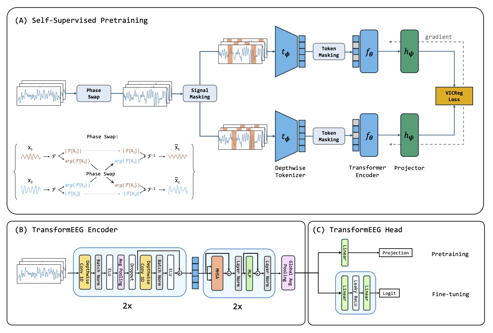

# Self-Supervised Representation Learning for EEG-Based Detection of Neurodegenerative Diseases

This is the official repository for the research paper 

    Self-Supervised Representation Learning for
    EEG-Based Detection of Neurodegenerative Diseases

Published in Applied Sciences.

In this work, we propose a pretraining approach that combines phase-swap data augmentation,
which is designed to facilitate learning EEG phase-amplitude coupling,
and a double-masking function that operates at the signal and transformer token levels.
The pretraining approach is illustrated below.

  

## Data Preprocessing

To preprocess the selected datasets, we recommend reading and following the instructions in the
[docs](https://github.com/MedMaxLab/eegprepro/blob/main/docs/2_DataPreparation.md) file.
These instructions explain how to download datasets from OpenNeuro and preprocess them with BIDSAlign.

## Authors and Citation

If you find the codes and results useful for your research,
Please consider citing our work.
It would help us continue our research.

Contributors:

- Federico Del Pup
- Louis Fabrice Tshimanga
- Andrea Zanola
- Luca Taffarello
- Elisa Tentori
- Prof. Manfredo Atzori

## License

The code is released under the MIT License
